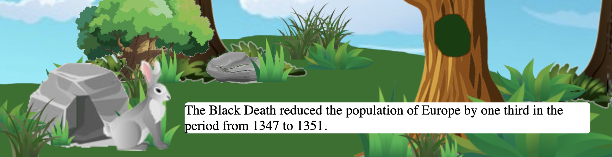

# Random Fact Forest

This is a random fact generator with a fun forest twist. The facts generated will be delivered via cute forest critters, but beware the evil disinformation Troll! Take the Trolls facts at your own risk. The Random fact Forest currently features two nice forest critters and one disinformation cave troll. 

Click the rock in front to see the bunny.
Click the tree with a hole to see the squirrel.
Click the keep out sign to see the evil disinformation cave troll. 

### This project was built with

- HTML 5
- CSS3
- JavaScript
- Jquery
- google fonts
- random fact API. 

#### See deployed site here!

https://hardcore-jackson-6303e5.netlify.app/

#### Future enhancements

in the future I would like to add more animals and animations. 